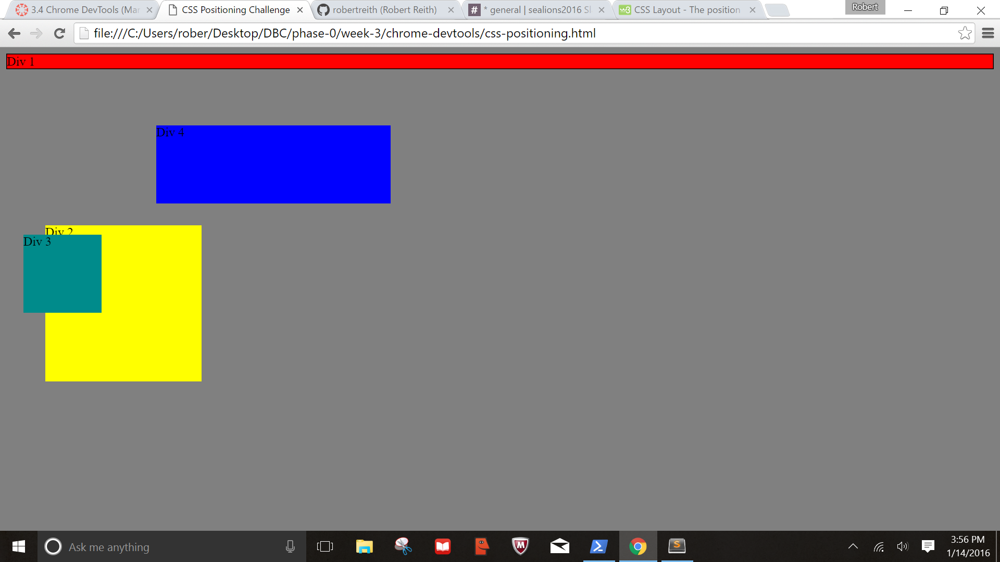
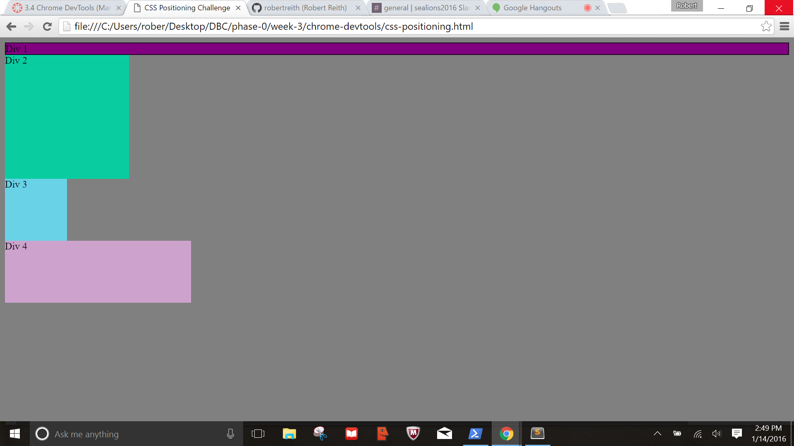
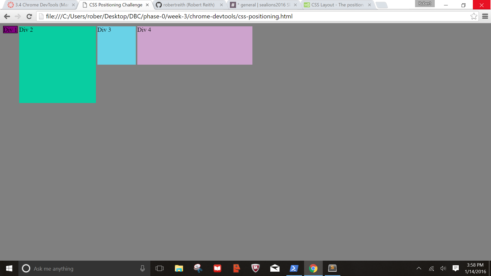
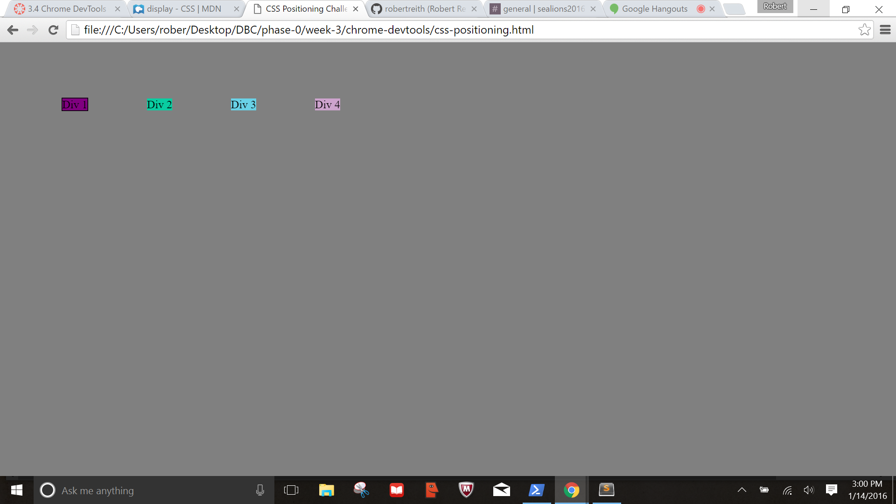
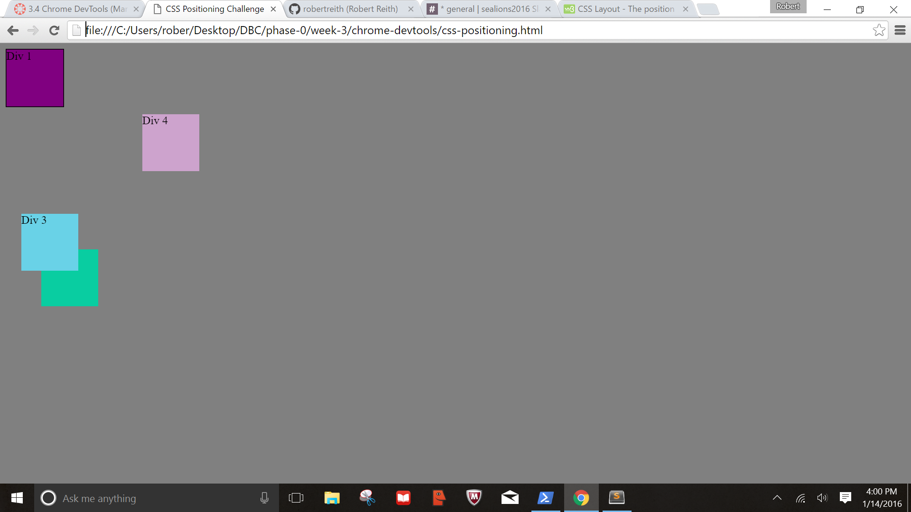
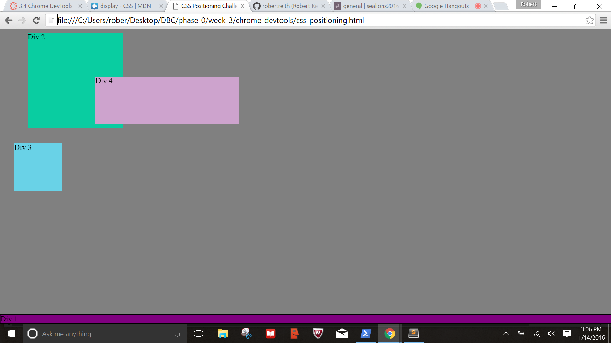
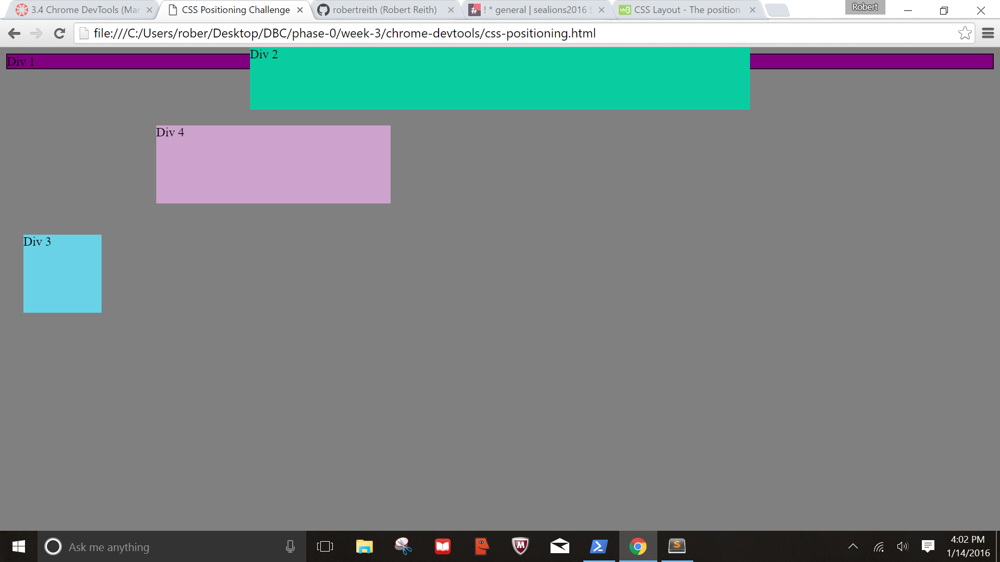
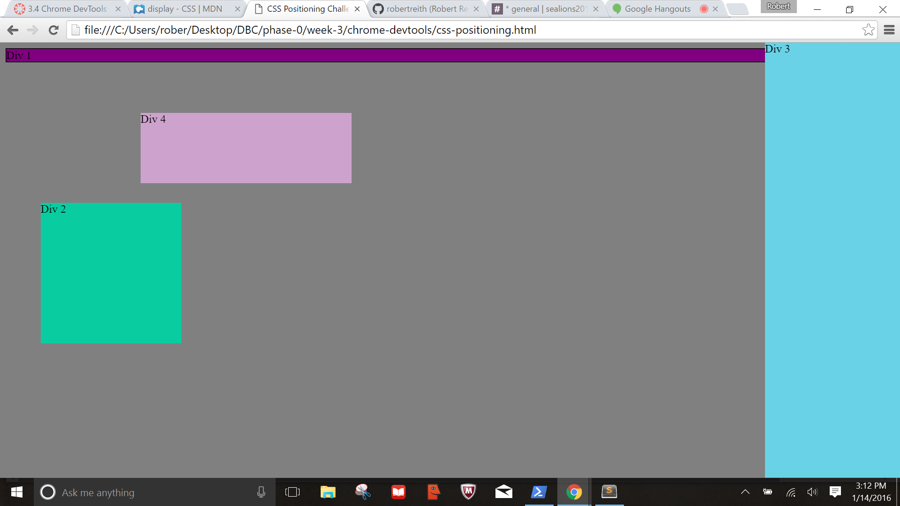
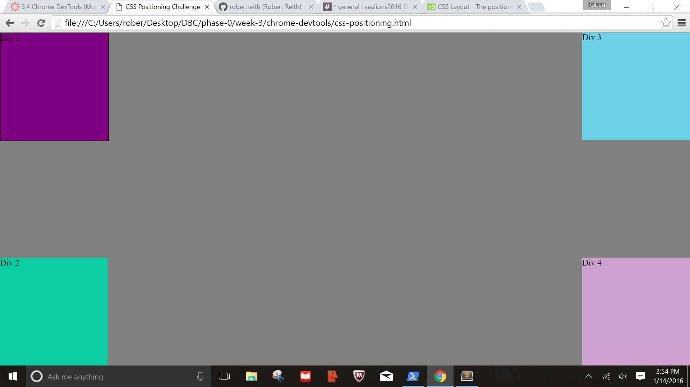

1.  Chrome DevTool’s inspector can help with formatting and positioning elements by editing in real time. This allows your fine tune your code without having to constantly save the files and refresh the web browser. 

2.  You can resize images by adjusting the margins, padding, borders, widths, and heights. 

3.  Absolute element scrolls with the page. Fixed positioned elements do not move when a page is scrolled. They stay in the same place. Static positioned elements are not affected by top, bottom, left, right properties. Relative positioned elements are adjusted based on their normal position (left, right, top, bottom).

4.  Margin: Adjust the white space outside of the borders
    Border: Allows elements to be fully inclosed as well as vertical and horizontal lines to a page
    Padding: Adjusts the white space inside between the content and the border.

5.  I found this challenge to be great. I didn’t know something like the dev tools existed. This is going to be a great resource to test css code in real time.